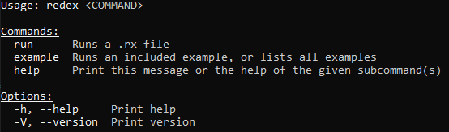

<center>
    <h1>Redex<h1>
    <h2>A proof of concept Rust-based scripting language.</h2>
    <br>
    <p>
    This is an undergraduate thesis/final project for New College of Florida - Ender
    </p>
</center>

<br>

## Table of Contents
<div>

- [Table of Contents](#table-of-contents)
- [Introduction](#introduction)
- [Installation](#installation)
- [Syntax and Examples](#syntax-and-examples)
  - [FizzBuzz](#fizzbuzz)
  - [Basic Variable Assignment](#basic-variable-assignment)
  - [Standard Functions](#standard-functions)
- [Components](#components)
  - [Lexer:](#lexer)
  - [Parser:](#parser)
  - [Runtime:](#runtime)
</div>

## Introduction
Redex is ground-up exploratory implementation into programming language design and development. It contains a regex based lexer to parse input into individual tokens, a rudamentary recursive descent parser to parse the tokens into an abstract syntax tree with token and positional information, and an interpreter to execute the AST. The language is dynamically typed, and supports basic arithmetic, variable assignment, and function definition. The language is written in Rust. It operates with no lexing/parsing libraries, utilizing Strum for enum generation and clap for command line argument parsing.

## Installation
Since Redex is written in Rust, all that needs to be done to install it is to clone the repository and run `cargo build --release`. This will create a binary in the `target/release` directory. This binary can be run with the `--help` flag to see the available options.

The main application provides a CLI for running redex programs and running some basic integrated examples, suchas a cli interpreter, fizz-buzz, and a basic echo program that replies with the input all available through ``redex example <program name>``

<br><br>
<center>

</center>
<br><br>

## Syntax and Examples
The syntax closely resembles JS with some Rust influences, it's dynamically typed with everything mutable.

### FizzBuzz
```js
let i = 0
while (true) {
    let a = i % 3
    let b = i % 5
    print(i)
    if (a == 0) {
        print("Fizz")
    }
    if (b == 0) {
        print("Buzz")
    }
    println("")
    let i = i + 1
}
```

### Basic Variable Assignment
```js
let string = "Hello World"
let number = 42
let boolean = true
let dict = [ "key": "value" ]
```

### Standard Functions
```js
sleep(1000) // Stops execution for 1000ms
print("Hello World") // Prints to stdout
println("Hello World") // Prints to stdout with a newline
readln() // Reads a line from stdin
net_get("https://google.com/") // Performs a GET request to the given URL
```

## Components
The language is split into two projects, the main application and it's runtime, and the parser. The parser is a library that can be used to parse Redex programs into an AST and export it as JSON if so desired.

### Lexer:
The 'lexing' portion is done within [The lexer's mod.rs](parser/src/lexer/mod.rs), importing it's tokens and the regex expressions associated from [The tokens file](parser/src/types/token.rs)

### Parser:
The main parse loop a child in [The root parser folder](parser/src/parser.rs), which handles processing incoming tokens and grouping them into expressions.

### Runtime:
The runtime is handled within the mod declaration of the [runtime](src/runtime/mod.rs), which handles the execution of the AST and the execution of the program.